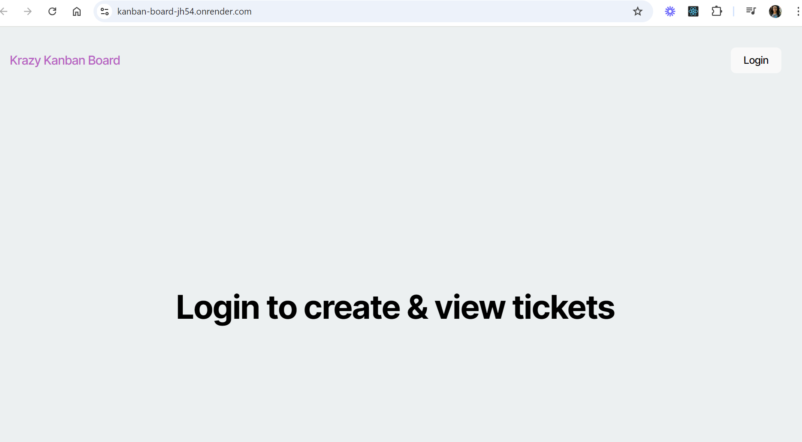
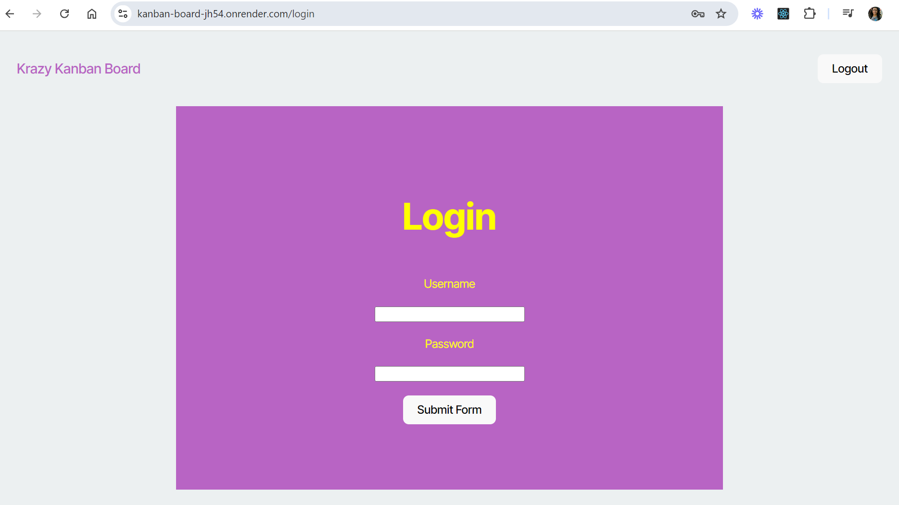
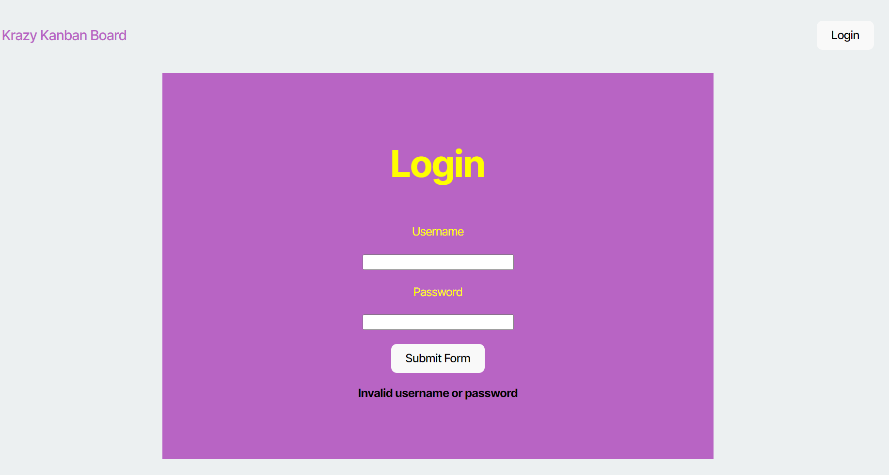
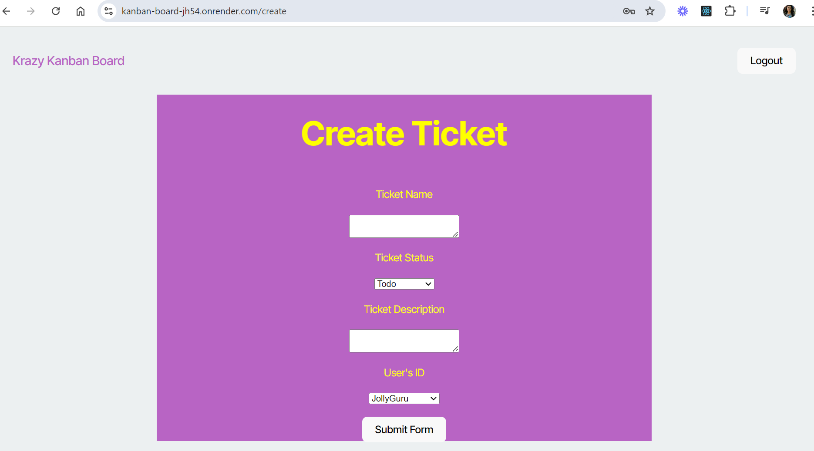

# Kanban Board

## Description

This Kanban board application is designed for agile teams, featuring secure login with JSON Web Token (JWT) authentication. Users can manage work tickets after logging in with their credentials. JWTs are securely stored in local storage for seamless access to the board, and they expire after a period of inactivity (1 hour). Unauthorized users are redirected to the login page, and upon logging out, the JWT is removed, ensuring secure session management.

## Table Of Contents

- [Installation](#installation)
- [Usage](#usage)
- [Technologies Used](#technologies-used)
- [License](#license)
- [Deployment](#deployment)
- [Questions](#questions)

## Installation

No installation required for a user, please refer to the [Deployment](#deployment) section to get to the link.

For someone contributing to this application:

- Clone the repository to your local machine.
- Install node.js.
- Navigate to the directory of the Kanban board and run on the terminal: **npm install**. This should install all of the dependencies on both the client and server side.
- Run the application locally by running on the terminal: **npm run start**

## Usage

To use the Kanban board application, start by navigating to the login page and entering your valid username and password. Once authenticated with a JSON Web Token (JWT), you will be redirected to the main Kanban board where you can create, update, and manage tasks across different columns such as "To Do," "In Progress," and "Done." If invalid login credentials are entered, an error message: "Invalid username or password" is displayed. The JWT is securely stored in local storage, allowing for authenticated access to the board in subsequent sessions. When you log out, you are then redirected to the login page. Additionally, after a period of inactivity, the session will expire, and you will need to log in again to continue managing your tasks.
To test this application, use the following credentials: 
username: JollyGuru
password: password

The below screenshot represents the homepage when the user is not logged in:

The below screenshot represents the login page either when the user clicks on login or logout once they're logged in.

The below screenshot represents the login page when the credentials are invalid:

The below screenshot represents the create page when the user wants to create a ticket:

## Technologies Used

- React
- Typescript / Javascript
- Node.js
- Express.js
- Postgres
- Render (for deployment)

## License

This project is licensed under the MIT License. To learn more about this means, click the license button at the top.

## Deployment

Visit this [link](https://kanban-board-jh54.onrender.com) to see the app live.

## Questions

GitHub Profile: https://github.com/Souad-hb

If you have any additional questions, feel free to contact me at: souadsalahh@gmail.com
